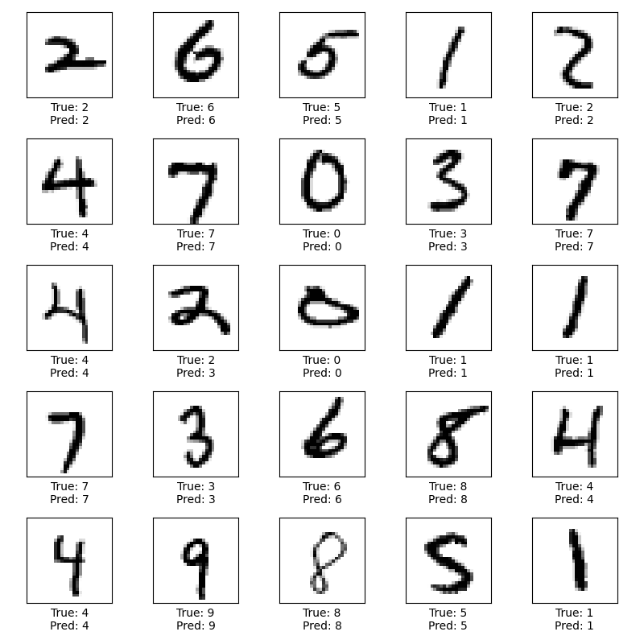

# Handwritten Digit Classification with TensorFlow

This project demonstrates the classification of handwritten digits from the MNIST dataset using a Convolutional Neural Network (CNN) built with TensorFlow. The MNIST dataset consists of grayscale images of digits (0-9), each sized 28x28 pixels.

## Features

- **Data Preprocessing**: Normalizes the images and reshapes them for compatibility with the CNN model.
- **Model Architecture**:
  - Three convolutional layers with ReLU activation.
  - Max-pooling layers for down-sampling.
  - Dense layers for classification.
- **Training and Validation**: Trains the model for 10 epochs with accuracy tracking on validation data.
- **Visualization**:
  - Training and validation accuracy plots.
  - A 5x5 grid displaying 25 random test images with their true and predicted labels.

## Requirements

To run this project, you'll need the following Python packages:

- `tensorflow`
- `numpy`
- `matplotlib`

Install them using:
```bash
pip install tensorflow numpy matplotlib
```

# Test Image Grid




